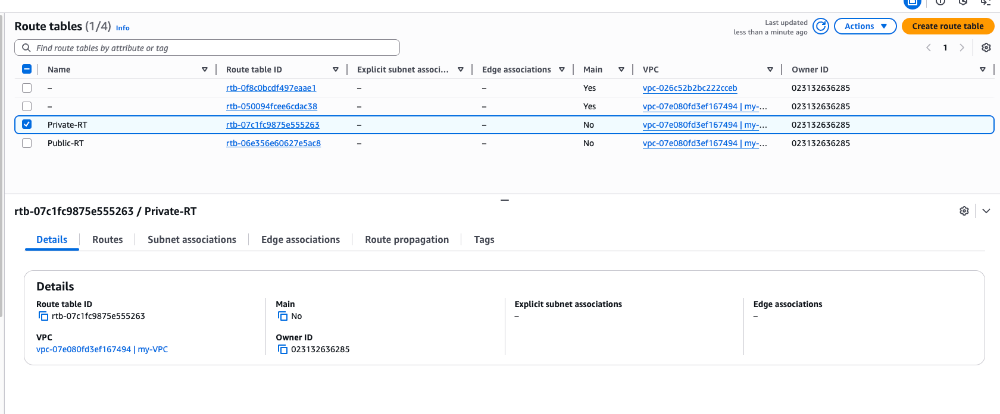

# AWS VPC Exercise

## Task

Create a VPC with the following requirements:

- Create two subnet groups: public and private
- Create one EC2 instance in the public subnet and one EC2 instance in the private subnet
- Ensure that the EC2 instance in the public subnet is accessible over the internet, allowing you to connect via SSH
- Ensure that the EC2 instance in the private subnet is not accessible from the internet but is accessible from the EC2 instance in the public subnet
- Ensure that the EC2 instance in the private subnet has access to the internet

## Architecture Overview

The architecture consists of:

- 1 VPC with custom CIDR block
- 2 Subnets (1 public, 1 private)
- 1 Internet Gateway for public subnet internet access
- 1 NAT Gateway for private subnet outbound internet access
- 2 Route Tables (1 public, 1 private)
- 2 EC2 Instances (1 public, 1 private)
- Security Groups configured for appropriate access

## Step-by-Step Guide

### Step 1: Navigate to VPC Service

Navigate to the AWS VPC Service in the AWS Console.

### Step 2: Create VPC

Create a new VPC with your desired CIDR block (e.g., 10.0.0.0/16).

### Step 3: Create Internet Gateway

Create an Internet Gateway that will be attached to your VPC to enable internet access for public subnets.

### Step 4: Attach Internet Gateway to VPC

Attach the Internet Gateway to your VPC.

### Step 5: Review Default Route Table

Review the default route table. We'll create custom route tables for public and private subnets.

### Step 6: Create Public Subnet

Create a public subnet within your VPC. This subnet will host the public EC2 instance.

### Step 7: Create Private Subnet

Create a private subnet within your VPC. This subnet will host the private EC2 instance.

### Step 8: Create NAT Gateway

Create a NAT Gateway in the public subnet. This will allow the private subnet to access the internet while remaining private.

### Step 9: Create Route Tables

Create route tables for public and private subnets.

### Step 10: Configure Route Tables

Edit the route tables to set up proper routing:

- Public route table: Add route to Internet Gateway (0.0.0.0/0 → IGW)
- Private route table: Add route to NAT Gateway (0.0.0.0/0 → NAT Gateway)

### Step 11: Verify Route Tables

Verify that your route tables are configured correctly.

### Step 12: Associate Subnets with Route Tables

Associate the public subnet with the public route table and the private subnet with the private route table.

### Step 13: Create Security Groups

#### Public EC2 Security Group

Create a security group for the public EC2 instance allowing SSH access (port 22) from your IP address.

#### Private EC2 Security Group

Create a security group for the private EC2 instance allowing SSH access from the public EC2 instance's security group.

### Step 14: Create Public EC2 Instance

Launch an EC2 instance in the public subnet with the following configuration:

- Instance in public subnet
- Assign public IP address automatically
- Use the public EC2 security group
- Select your key pair for SSH access

### Step 15: Create Private EC2 Instance

Launch an EC2 instance in the private subnet with the following configuration:

- Instance in private subnet
- No public IP address
- Use the private EC2 security group
- Use the same key pair

### Step 16: Verify EC2 Instances

Verify that both EC2 instances are running.

### Step 17: Ensure Public IP Assignment

Verify that the public EC2 instance has a public IP address.

### Step 18: Connect to Public EC2 Instance

SSH into the public EC2 instance using its public IP address and your key pair.

### Step 19: Connect to Private EC2 via Public EC2

From the public EC2 instance, SSH into the private EC2 instance using its private IP address.

### Step 20: Verify Internet Access from Private Subnet

Verify that the private EC2 instance can access the internet through the NAT Gateway.

## Verification Checklist

✅ VPC created with custom CIDR block
✅ Internet Gateway created and attached to VPC
✅ NAT Gateway created in public subnet
✅ Two subnets created (public and private)
✅ Route tables configured correctly
✅ Subnets associated with appropriate route tables
✅ Security groups configured for public and private instances
✅ Public EC2 instance accessible via SSH from internet
✅ Private EC2 instance accessible from public EC2 instance
✅ Private EC2 instance has outbound internet access via NAT Gateway

## Architecture Benefits

- **Security**: Private subnet instances are not directly accessible from the internet
- **Outbound Internet Access**: Private instances can access the internet for updates and downloads via NAT Gateway
- **SSH Access**: You can SSH into the private instance through the public instance (bastion host)
- **Cost Effective**: NAT Gateway provides efficient outbound internet access for private resources

## Security Notes

- The public EC2 instance acts as a bastion host
- Private instances cannot be directly accessed from the internet
- Security groups control access between instances
- NAT Gateway provides one-way outbound internet access for private instances
